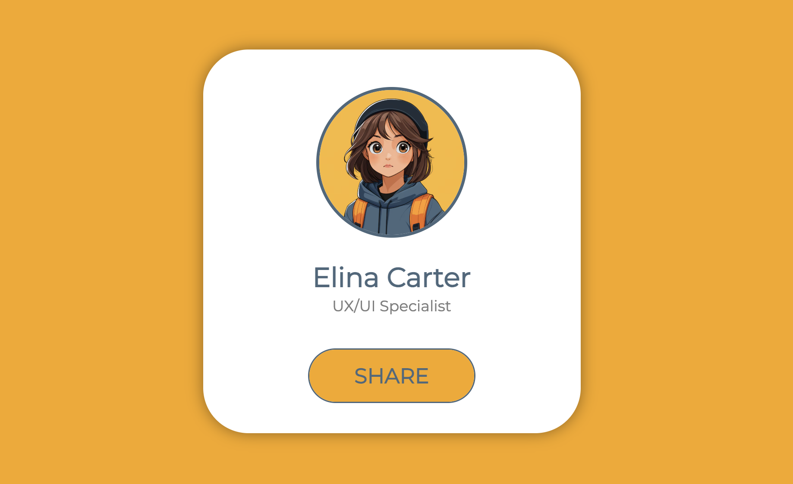

# Share Button Hover Effect

A clean and responsive **Share Button Hover Animation** built using pure HTML and CSS.  
Perfect for blog posts, card layouts, or interactive UI components.

✅ How It Works -
** Uses transform and opacity to animate social icons.
** Each .social-button a appears with a delay using transition-delay.
** .button-content shrinks and moves upward on hover using
** transform: translateY(-50%) scale(0.4).

Clean use of flex for alignment and z-index layering.


## 📸 Preview


## 🚀 Demo

Check out the live demo on YouTube:  
🔗 [Watch the video][((https://youtu.be/p24srN-XxRY))]

## 📁 Source Code

Feel free to explore or clone the code:  
🔗 [GitHub Repository](https://github.com/Nazia-99/Share-Button-Hover-Effect)

## 📌 How to Use

1. Clone the repository:
   ```bash
   git clone https://github.com/Nazia-99/Animated-Border-Card.git


## 📂 Files Included

- `index.html` — Main HTML structure
- `code-with-nazia.css` — All styling and animations
- `screenshot-.png` — Project preview image


Created with ❤️ by [**Code with Nazia**](https://www.youtube.com/@CodeWithNazia)


